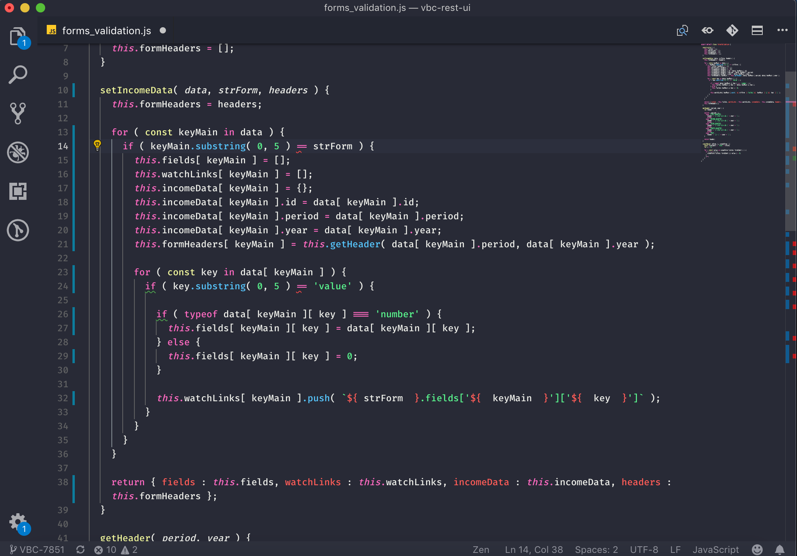
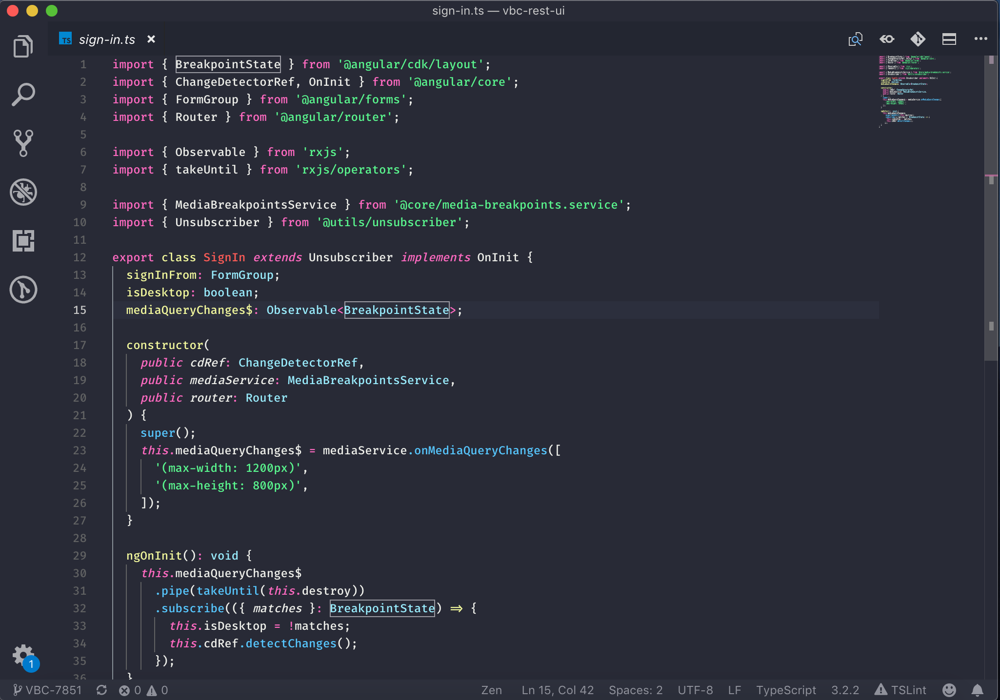
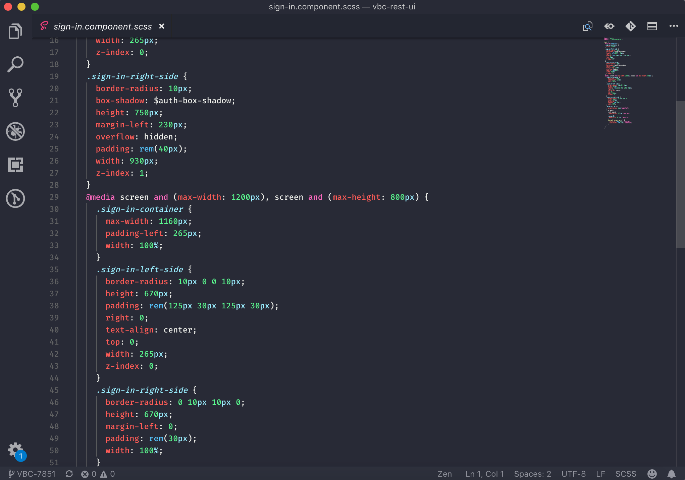

# README
## Snazzy Colors
This theme based on [Snazzy Theme](https://github.com/aaronthomas/vscode-snazzy-operator) with some tweaks for TypeScript and JavaScript.

## Installation

This theme can be installed in VS Code via Quick Open (⌘P) by running:

```
ext install snazzy-colors-theme
```

Alternatively it can be found using the Extensions search feature (⇧⌘X).

## Screenshots







**Enjoy!**